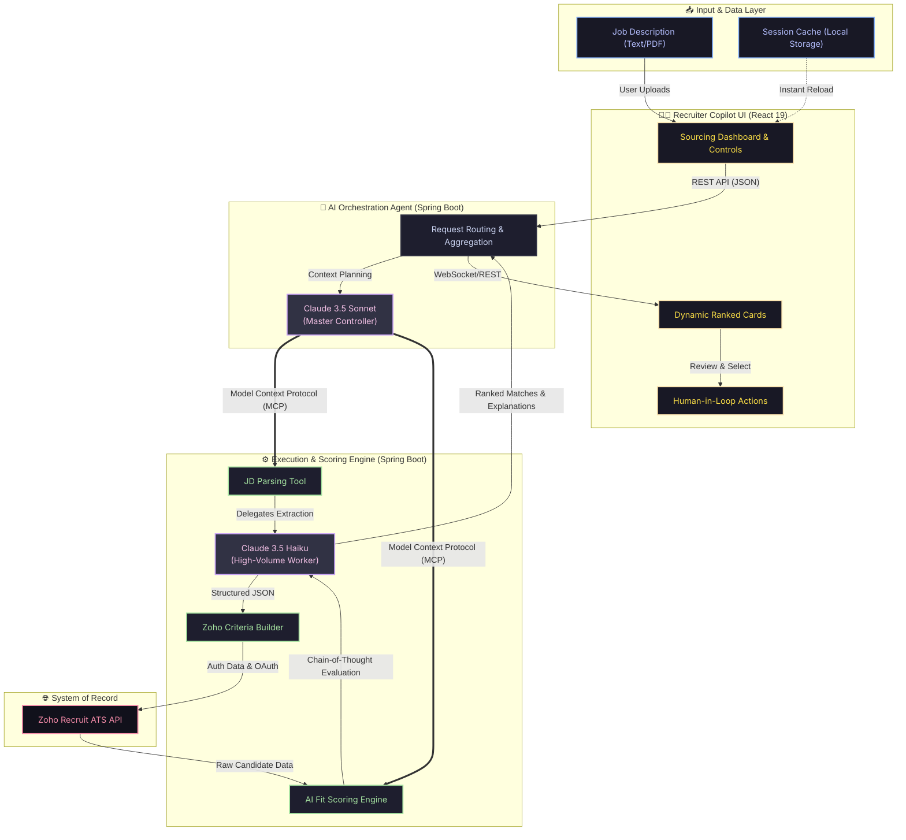

# Wissen AI ATS — Enterprise Architecture & Pitch

**Project:** Wissen AI ATS
**Team Titan Transformers:** Sudarshan Garg, Saurabh Kumar, Rupam Swain, Suryaprakash Rao

*This document is designed for investor and hackathon-judge presentations. It provides a visual, explainable, and premium technical blueprint of the real implementation.*

---

## 🌟 The Innovation Highlight

Before diving into the architecture, here is why Wissen AI ATS wins structurally:

*   **Autonomous Sourcing instead of Manual Sourcing:** The system doesn't just read Job Descriptions (JDs); it uses LLMs to autonomously translate raw JD text into complex database criteria (`(Skill_Set:equals:React) AND (Experience:equals:5)`) and queries Zoho APIs in milliseconds.
*   **Explainable AI Scoring instead of Black-Box Ranking:** Judges and enterprise clients hate black boxes. Our `AIEnhancedCandidateRankingService` utilizes Chain-of-Thought reasoning to output a transparent "Fit Analysis" explaining exactly *why* a candidate was ranked #1, including identified missing skills.
*   **Multi-Agent Execution for Scale:** By leveraging the enterprise-ready **Model Context Protocol (MCP)**, we separate AI Orchestration (using Claude 3.5 Sonnet) from high-volume tool execution (using Claude 3.5 Haiku). This provides immense scalability.
*   **Human-in-the-Loop for Trust:** AI suggests the pipeline and ranks candidates, but the recruiter retains full control over the final interface (Recruiter Copilot) to validate the matches before moving them forward.
*   **Startup-Ready Scalable Architecture:** Decoupled Spring Boot microservices interacting over robust JSON-RPC protocols, supported by an optimized React 19 glass-morphism frontend.

---

## 🏗️ Premium System Architecture

*Input → Intelligence → AI Decision → Recruiter Copilot → Final Output*

---

## 📖 How to Explain This Architecture Live

When presenting to judges or investors, guide them through the diagram from Top-to-Bottom:

### 1. The Input & Copilot Layer (Yellow/Blue)
*   **Narrative:** "We start at the Recruiter Copilot. The user provides unstructured data—a raw PDF or text Job Description. The React frontend provides instant feedback and accesses cached session memory, preventing redundant API calls to save costs."

### 2. The Orchestration Layer (Purple)
*   **Narrative:** "Once the request is initiated, it hits our Spring Boot Client Layer running **Claude 3.5 Sonnet**. Sonnet acts as the 'Lead Architect.' It doesn't parse data itself; rather, it uses the **Model Context Protocol (MCP)** to securely orchestrate backend tools, completely abstracting complex API lifecycles from the frontend."

### 3. The Execution & Automation Layer (Green)
*   **Narrative:** "The tools spin up inside an isolated Spring Boot Server. Here, we utilize **Claude 3.5 Haiku** for high-volume, rapid structured extraction. Haiku translates the messy JD into strict Zoho API search syntax dynamically."

### 4. External Integration & Resolution (Red)
*   **Narrative:** "We fetch the raw, unorganized candidate pools securely via OAuth from Zoho Recruit. Instead of blindly passing this to the user, the data hits our custom **AI Fit Scoring Engine**."

### 5. Final Explanation & Output
*   **Narrative:** "Haiku evaluates every candidate against the parsed JD in parallel, producing a score, an identified list of missing skills, and a human-readable explanation. The Orchestrator collects these outputs and pushes them back to the React Copilot, delivering a fully vetted, ranked shortlist in seconds."

---

## 🛠 Backend Matching & Scoring Logic

Our matching methodology does not rely on simple regex keyword counts. Instead, the backend implements **Semantic Fit Analysis**:

1.  **Skills Matrix Validation:** Identifying direct hits between candidate resumes and extracted *Must-Have* technical skills.
2.  **Contextual Seniority Parsing:** Matching the candidate's historical responsibilities against the implicitly required job level (e.g., Staff Engineer vs. Junior Developer).
3.  **Explainability Output:** Generating a strict JSON format that includes a `rankPosition`, `matchPercentage`, `matchedSkills`, `missingSkills`, and a 50-word `matchReasoning` string.

If the LLMs experience latency or Anthropic goes down, the backend uses **Graceful Degradation** to fall back to a local string-matching criteria builder, ensuring the enterprise product never experiences full downtime.
